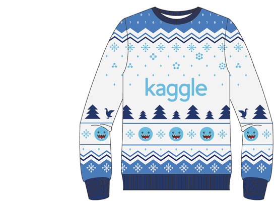

# tabular-playground-series-jan2022
Tabular Playground Series - Jan 2022 Practice your ML skills on this approachable dataset!

# Overview
Kaggleグッズを販売する2つの（架空の）独立した店舗チェーンが、Kaggleに関するあらゆるものの公式アウトレットになりたいと考えています。私たちは、Kaggleコミュニティの皆さんに、どちらのチェーン店が将来的に最も売上を伸ばすことができるか、ご協力いただけるかどうかを確認することにしました。そこで、私たちはデータを収集し、私たちが判断するための予測モデルを構築するよう皆さんにお願いしています。

KaggleMartとKaggleRamaのどちらが公式Kaggleアウトレットになるべきかを決めるのを手伝ってください!
上位に入賞すると服がもらえるらしい。
</img>

この課題では、3カ国にある2つの店舗で、3つの商品の1年分の売上を予測していただきます。このデータセットは完全に架空のものですが、週末や祝日の効果、季節など、現実世界のデータで見られる多くの効果が含まれています。このデータセットは十分に小さいので、数多くの異なるモデリングアプローチを試すことができます。

#### ファイル名
* train.csv - 各日付と国・店舗・商品の組み合わせの販売データを含む学習セット。
* test.csv あなたのタスクは、各日付と国・店舗・アイテムの組み合わせについて、対応するアイテムの売上を予測することです。パブリックリーダーボードは最初の四半期に、プライベートは残りの四半期に採点されることに注意してください。
* sample_submission.csv - 正しい形式のサンプル提出ファイルです。
# Log
# 2022/01/14
* 〆切：1/31まで
* 各日付・国・店舗・グッズの組み合わせに対応するアイテムの売り上げを予測する
    * 3つの商品の1年分の売り上げを予測する
    * 6570行のnum_soldを予測する

# 2022/01/15
* 国ごとの総売上個数(2018年人口)
    * Finland    2680927(551.6万人)
    * Norway     4404706(531.2万人)
    * Sweden     3105725(1018万人)
    * 人口の多いスウェーデンが総売上個数が多いと予想したがノルウェイが一番売上個数が多かった

# 2022/01/26
* ベース(https://www.kaggle.com/hikarumoriya/tabular-playground-eda-jpn)
* 各アイテムの売れ行きを予測するために必要なこと
    * 回帰予測で各アイテムの回帰直線をプロットできれば予測結果が出そう
